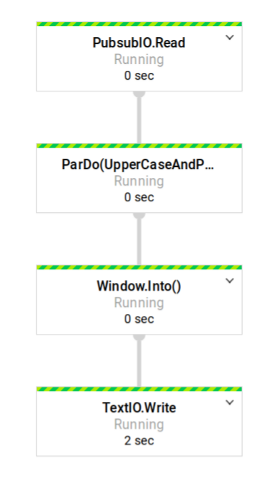

# Google Storage Sink
A small backup tool which collects data from a given PubSub topic and writes it to the designated Google storage
bucket. The application is built upon `Apache Beam` which is a stream/batch data processing tool. [click here]
(https://beam.apache.org/get-started/beam-overview/) to learn more about the Apache Beam model. Due to the source
of the application (PubSub), the Dataflow job that will be created is a `streaming` job.

## Requirements

* Java 1.8 SDK
* Google Service account with the following access:
    * Compute Viewer
    * Dataflow Developer
    * Storage Admin to the bucket where it will write to
    * PubSub Admin from the PubSub topic where it will read from

## Deployment

Since the application is a streaming application, it's as simple as running the following commands:

Build the application with all the added dependencies
```
    $ ./gradlew clean fatJar
```

Run the application
```
    BUCKET_NAME=test_bucket
    $ java -jar build/libs/google-storage-sink-all-1.0-SNAPSHOT.jar \
        --runner=DataflowRunner
        --tempLocation=gs://BUCKET_NAME/tmp \
        --stagingLocation=gs://BUCKET_NAME/stg \
        --subnetwork=regions/REGION/subnetworks/SUBNETWORK 
```
Apache Beam supports multiple parameters when running the application. The complete list [can be found here]
(https://cloud.google.com/dataflow/pipelines/specifying-exec-params).

The image below shows the Dataflow job that will be created with the commands shown above.



